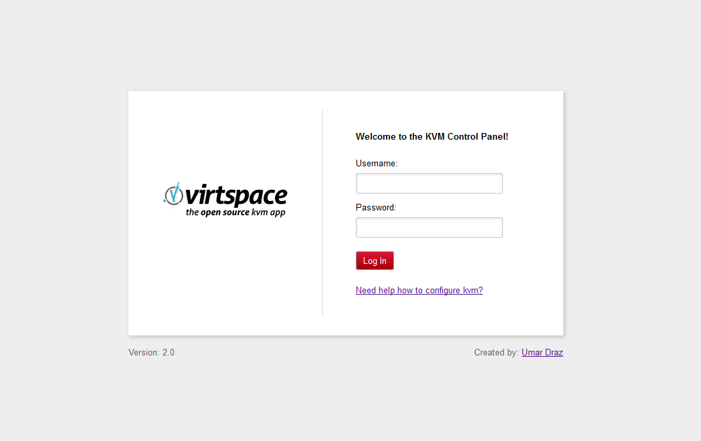

Virtspace
=========

Virtspace is a Web Based Management tool created for Linux KVM Administration with PHP-Libvirt and MongoDB

What is it?
============

The Virtspace provides an web based linux KVM administration system to allow administrators to easily manage virtual machines, kvm servers, storages, virtual and bridge networks. Virtspace is free software; you can redistribute it and/or modify it under the terms of the GNU General Public License version 3.

Virtspace was written in PHP, It requires PHP 4 and above, libvirt library for php and MongoDB as backend database.

1. Features
===========

Standard and enhanced features from Virtspace includes:

* Super admin user level with full access.
* Domain live and offline migration, with central storage.
* Domain modification, adding removing network, virtual drives, snapshots.
* JQuery Datatable throughout for quick in browser searching and pagination.
* Predefine templates help for creating new domain very quickly.
* LVM and any Directory based storage supported.
* Image cloning within storage and outside of the storage.
* Virtual networking with (Nat, Static and Routing) fully supported.
* Virtual machine searching.

2. Screenshots
==============

Here is some screenshots of Virtspace

1. Login Page
-------------

2. Servers List
----------------

3. New Virtual Machine
----------------------

4. Distributions List
---------------------

2. How to Install
=================

**Ubuntu:**  https://github.com/umardraz/virtspace/blob/master/Virtspace-Ubuntu.rst

**CentOS:**  https://github.com/umardraz/virtspace/blob/master/Virtspace-CentOS.rst

**For any bug Report or suggesions:** Please email me umar_draz@yahoo.com
